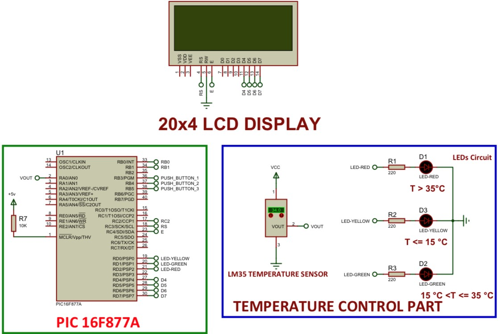

# Embedded System Design: Temperature-Based LED & Push_Button-Based Motor Control Using PIC16F877A (20x4 LCD display Added)
This repository contains an embedded system project that demonstrates **temperature-based LED control** with a **20x4 LCD display** and **motor speed & direction control** using the **PIC16F877A** microcontroller. The project is implemented using **Proteus 8.10** for simulation and **MPLAB X IDE with XC8 Compiler** for code development.

## Repository Structure:

```bash
📂 Embedded_System_LED_and_Motor_Control_with_20x4_LCD
├── 📂 HexFile
│   └── LM35_PIC16F877A_LEDs_20X4_LCD_MOTOR_PUSH_BUTTONS.X.production.hex
├── 📂 Header files
│   ├── motor_control.h
│   ├── temp_control.h
│   ├── lcd_control.h
├── 📂 Source files
│   ├── main.c
│   ├── motor_control.c
│   ├── temp_control.c
│   ├── lcd_control.c
├── 📂 ProteusProject
│   └── LM35-PIC16F877A-LEDs-20x4_LCD-MOTOR-PUSH-BUTTONS.pdsprj
├── 📂 Documentation
│   ├── Project Report 3.pdf
│   ├── Circuit_Diagram.jpg
├── LICENSE
├── README.md
└── requirements.txt


```

## Table of Contents

- [Project Overview](#project-overview)
- [Circuit Diagram](#circuit-diagram)
- [Installation](#installation)
- [Usage](#usage)
- [Software and Tools](#software-and-tools)
- [Dependencies](#dependencies)
- [Authors](#authors)
- [License](#license)

## Project Overview

The project consists of two main components:

1. **Temperature-Based LED Control with 20x4 LCD**
   - **Microcontroller Used:** PIC16F877A
   - **Sensor:** LM35 Temperature Sensor
   - **Display:** 20x4 LCD for temperature readings
   - **LED Behavior:**
     - Temperature ≤ 15°C → Yellow LED ON
     - Temperature between 15°C and 35°C → Green LED ON
     - Temperature > 35°C → Red LED ON
   - **LCD Display:** The 20x4 LCD shows real-time temperature readings.

2. **Motor Speed and Direction Control**
   - **Microcontroller Used:** PIC16F877A
   - **Motor Driver:** L293D
   - **Push Buttons:**
     - Button 1 → Motor runs slowly forward
     - Button 2 → Motor runs fast forward
     - Button 3 → Motor runs fast in reverse direction
    
## Circuit Diagram
   

## **Installation**
### **1. Clone the Repository**
```bash
git clone https://github.com/Kaleabt37/Embedded_System_LED_and_Motor_Control_with_20x4_LCD.git
cd Embedded_System_LED_and_Motor_Control_with_20x4_LCD
```
### **2. Open the Proteus Project**

- Navigate to the ProteusProject folder
- Open the LM35-PIC16F877A-LEDs-20x4_LCD-MOTOR-PUSH-BUTTONS project file in Proteus

### **3. Load the HEX File**

- In Proteus, double-click the PIC16F877A microcontroller
- In the Program File section, click the folder icon
- Navigate to HexFile/ and select the LM35_PIC16F877A_LEDs_20X4_LCD_MOTOR_PUSH_BUTTONS.X.production.hex file

### **4. Run the Simulation**

- Click Run Simulation and observe the LED, LCD & Motor behavior


## **Usage**
### **1. Microcontroller Behavior**

- Temperature-Based LED Control with 20x4 LCD:
  - Temperature ≤ 15°C → Yellow LED ON, LCD displays "Low Temp: XX°C"  
  - Temperature between 15°C and 35°C → Green LED ON, LCD displays "Normal Temp: XX°C"  
  - Temperature > 35°C → Red LED ON, LCD displays "High Temp: XX°C"  

- Motor Speed & Direction Control:
  - Push_Button 1 → Motor runs slowly forward  
  - Push_Button 2 → Motor runs fast forward  
  - Push_Button 3 → Motor runs fast in reverse  

### **2. How to Modify the Code**

- Open the main.c file located in Source files/
- Modify the logic inside motor_control.c, temp_control.c, and lcd_control.c as needed
- Recompile the code using MPLAB X IDE
- Generate a new HEX file and update the Proteus simulation


## **Software and Tools**
```bash
|   Software   |            Purpose           |
|--------------|------------------------------|
| Proteus 8.10 | Circuit simulation           |
| MPLAB X IDE  | Writing and compiling C code |
| XC8 Compiler | Generating HEX files         |
```

## **Dependencies**

- This project requires the following tools:
  
  - Proteus 8.10 (for circuit design and testing)
  - MPLAB X IDE (for developing and compiling the C code)
  - XC8 Compiler (for compiling the source code)

## **Authors**

# This project was developed by Kaleab Tesfaye


## **License**

- This project is licensed under the MIT License – see the LICENSE file for details.

